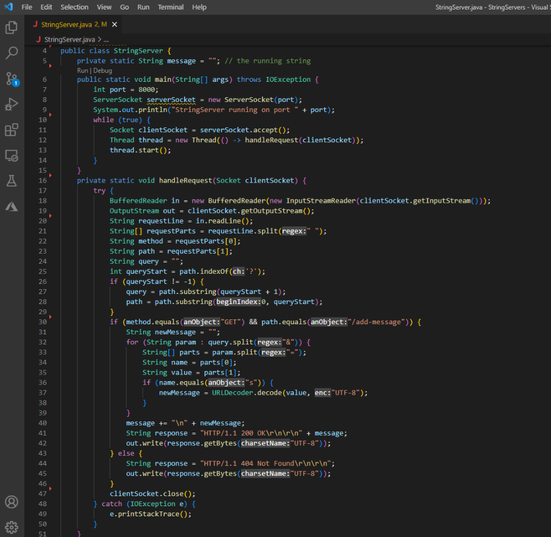
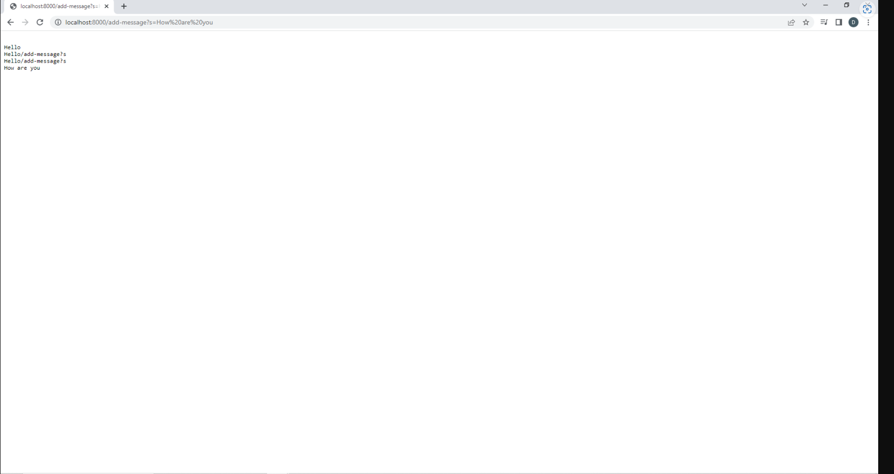
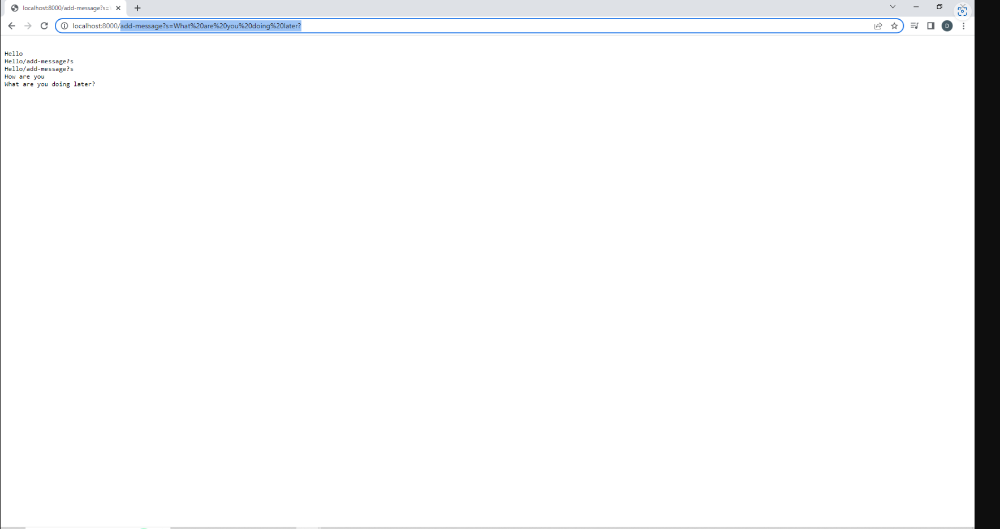

>For the following code,

>The method called is **handleRequest(Socket clientSocket)**, the relevant argument 'clientSocket' responds back to the client which is a reference to the client's socket, the request is a 'GET' request for the add-message path that has a query param called 's' which for this example would be 'Hello'. The field changes include 'message' being update to 'Hello' instead of being empty. 
> 
>For the next image, the same method **handleRequst(Socket clientSocket)** is being called, the relevent args are 'clientSocket' and the GET request adds the message with the same param 's' which is set to 'What are you doing later?'. The field 'message' now changes to 'What are you doing later?'. 
