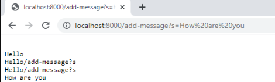
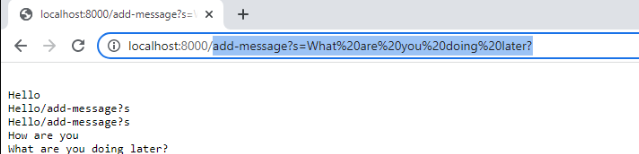
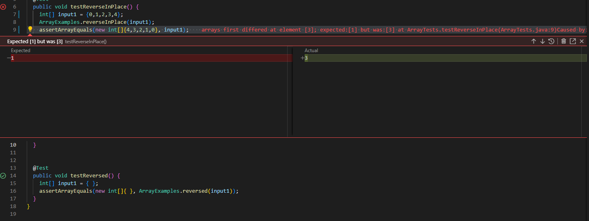

# Part 1  

```
import java.io.*;
import java.net.*;
import java.util.*;
public class StringServer {
    private static String message = ""; // the running string
    public static void main(String[] args) throws IOException {
        int port = 8000;
        ServerSocket serverSocket = new ServerSocket(port);
        System.out.println("StringServer running on port " + port);
        while (true) {
            Socket clientSocket = serverSocket.accept();
            Thread thread = new Thread(() -> handleRequest(clientSocket));
            thread.start();
        }
    }
    private static void handleRequest(Socket clientSocket) {
        try {
            BufferedReader in = new BufferedReader(new InputStreamReader(clientSocket.getInputStream()));
            OutputStream out = clientSocket.getOutputStream();
            String requestLine = in.readLine();
            String[] requestParts = requestLine.split(" ");
            String method = requestParts[0];
            String path = requestParts[1];
            String query = "";
            int queryStart = path.indexOf('?');
            if (queryStart != -1) {
                query = path.substring(queryStart + 1);
                path = path.substring(0, queryStart);
            }
            if (method.equals("GET") && path.equals("/add-message")) {
                String newMessage = "";
                for (String param : query.split("&")) {
                    String[] parts = param.split("=");
                    String name = parts[0];
                    String value = parts[1];
                    if (name.equals("s")) {
                        newMessage = URLDecoder.decode(value, "UTF-8");
                    }
                }
                message += "\n" + newMessage;
                String response = "HTTP/1.1 200 OK\r\n\r\n" + message;
                out.write(response.getBytes("UTF-8"));
            } else {
                String response = "HTTP/1.1 404 Not Found\r\n\r\n";
                out.write(response.getBytes("UTF-8"));
            }
            clientSocket.close();
        } catch (IOException e) {
            e.printStackTrace();
        }
    }
}
```  


  
>The method called is **handleRequest(Socket clientSocket)**, the relevant argument 'clientSocket' responds back to the client which is a reference to the client's socket, the request is a 'GET' request for the add-message path that has a query param called 's' which for this example would be 'Hello'. The field changes include 'message' being update to 'Hello' instead of being empty.  
 
 
>For the next image, the same method **handleRequst(Socket clientSocket)** is being called, the relevent args are 'clientSocket' and the GET request adds the message with the same param 's' which is set to 'What are you doing later?'. The field 'message' now changes to 'What are you doing later?'.  

## Part 2  


```
public class ArrayTests {
	@Test 
	public void testReverseInPlace() {
    int[] input1 = {0,1,2,3,4};
    ArrayExamples.reverseInPlace(input1);
    assertArrayEquals(new int[]{4,3,2,1,0}, input1);
	}
```  

the following code above tests the code below by inputting an array of values, the code below is intended to take in an array and reverse each element, but results in a failure:  

```
static void reverseInPlace(int[] arr) {
    for(int i = 0; i < arr.length; i += 1) {
      arr[i] = arr[arr.length - i - 1];
    }
  }
```  
This input also adds a test case with an input paramater as an array for a different line of code:  

```
@Test
  public void testReversed() {
    int[] input1 = { };
    assertArrayEquals(new int[]{ }, ArrayExamples.reversed(input1));
  }
}
```  

the different line of code for the test case above takes in the array as an input, and reverses each element:  

```
static int[] reversed(int[] arr) {
    int[] newArray = new int[arr.length];
    for(int i = 0; i < arr.length; i += 1) {
      arr[i] = newArray[arr.length - i - 1];
    }
    return arr;
  }
```  

 
for this code, the void keyword is the sympton in this code which causes `reverseinplace`  to not return anything, along with needed a temp value to save our initial value. Since the code requires a returned variable, the void keyword automatically disables the block of code from returning any kind of value, so removing it is necessary.  

Here is the code before the bug is fixed:  

```
static void reverseInPlace(int[] arr) {
    for(int i = 0; i < arr.length; i += 1) {
      arr[i] = arr[arr.length - i - 1];
    }
  }
```  
Here is the code after the bug is fixed:  


```
static int[] reverseInPlace(int[] arr) {
    for(int i = 0; i < arr.length; i += 1) {
      int temp=arr[i];
      arr[i] = arr[arr.length - i - 1];
      arr[arr.length-i-1]=temp;

    }
    return arr;
  }
```  
## Part 3  

In lab week 3, I learned that in order to sucessfully create a new local host you need to have a port number that is unique, which means the number should usually be a very high-valued number. 


